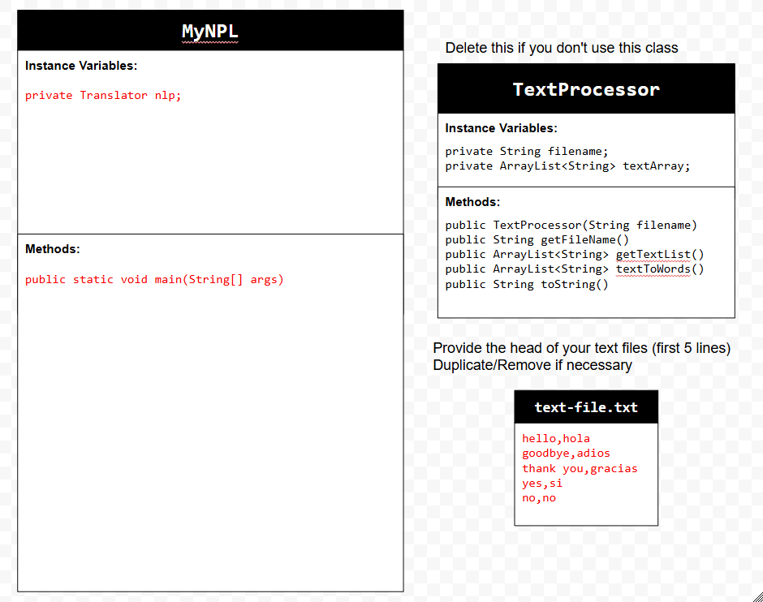
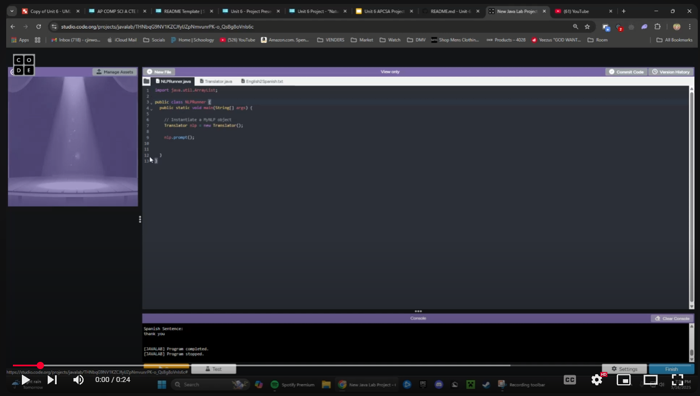

# Unit 6 - Natural Language Processing Project

## Introduction

Natural language processing (NLP) is used in many apps and devices to interact with users and make meaning of text to determine how to respond, find information, or to create new text. Your goal is to use natural language processing techniques to identify structure, patterns, and meaning in a text to have conversations with a user, execute commands, perform manipulations on the text, or generate new text.

## Requirements

Use your knowledge of object-oriented programming, ArrayLists, the String class, and algorithms to create a program that uses natural language processing techniques:

- **Create at least two ArrayLists** – Create at least two ArrayLists to store the data used in your program, such as data from text files or entered by the user.
- **Implement one or more algorithms** – Implement one or more algorithms that use loops and conditionals to find or manipulate elements in an ArrayList or String object.
- **Use methods in the String classs** - Use one or more methods in the String class in your program, such as to divide text into sentences or phrases.
- **Use at least one natural language processing technique** – Use a natural language processing technique to process, analyze, and/or generate text.
- **Document your code** – Use comments to explain the purpose of the methods and code segments and note any preconditions and postconditions.

## UML Diagram

Put and image of your UML Diagram here. Upload the image of your UML Diagram to your repository, then use the Markdown syntax to insert your image here. Make sure your image file name is one word, otherwise it might not properly get display on this README.

## Video

Record a short video of your project to display here on your README. You can do this by:

- Screen record your project running on Code.org.
- Upload that recording to YouTube.
- Take a thumbnail for your image.
- Upload the thumbnail image to your repo.
- Use the following markdown code:

(https://youtu.be/IQDkpL53u8s)

## Project Description

The goal of this application is to provide a simple English-to-Spanish translation tool. The application allows users to input a sentence in English, which is then processed and translated word by word into Spanish. If a word is not found in the translation dictionary, the program notifies the user. The program utilizes a predefined text file, English2Spanish.txt, which contains a dictionary of English words and their corresponding Spanish translations. Users interact with the application through the console, where they are prompted to enter an English sentence. The translated sentence is then displayed as output.

## NLP Techniques

NLP Techniques
Splitting Sentences into Words (Tokenization)
- Method: translateSentence(String sentence)
- This method breaks a sentence into individual words so each word can be translated separately.

Removing Punctuation
- Method: removeTailPeriodOrComma(String[] words)
- This method removes extra punctuation like commas and periods to ensure words match the dictionary.

Finding Translations (Dictionary Lookup)
- Method: findEnglishWordIndex(String word)
- This method searches for a word in the dictionary and finds its Spanish equivalent. If the word is not found, the user is informed.

Rebuilding the Sentence
- Method: translateSentence(String sentence)
- This method puts the translated words back together into a full sentence.